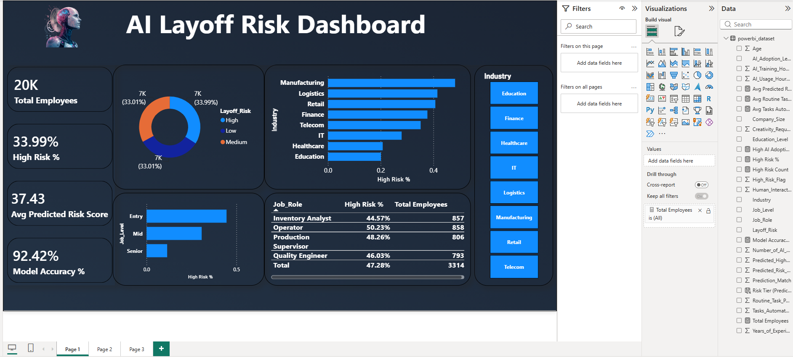
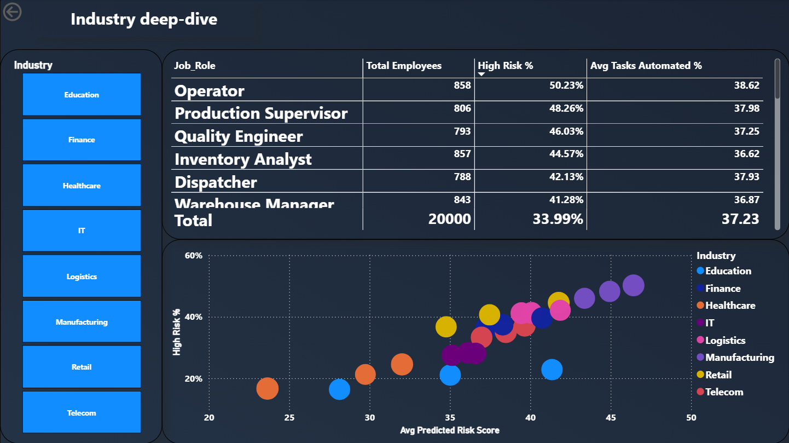
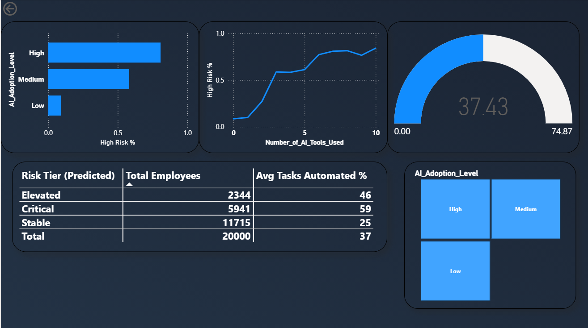

# AI Impact on Jobs: Layoff Risk Analysis

An end-to-end data analytics project examining how AI adoption and task automation relate to employee layoff risk — built using **Python**, **PostgreSQL**, and **Power BI**.

> 📊 20,000 employee records · 🎯 92.4% out-of-sample model accuracy · 🏭 8 industries, 24 job roles analyzed

---

## 🔍 Problem Statement

As organizations adopt AI and automation at scale, roles built on routine, repeatable tasks face rising displacement risk — while roles demanding creativity and human judgment remain comparatively insulated.

**This project answers a concrete question:** Which combination of role, industry, and individual factors predicts layoff risk in an AI-disrupted workforce — and can that risk be modeled and flagged reliably?

---

## 🧰 Tech Stack

| Tool | Role in This Project |
|---|---|
| **Python** (Pandas, NumPy, Matplotlib, Seaborn, Scikit-learn) | EDA, feature engineering, classification modeling |
| **PostgreSQL** | Business-style queries — aggregation, CTEs, window functions |
| **Power BI** | 3-page interactive dashboard, integrating model output |

---

## 📁 Repository Structure

---

## 📊 Dataset

**Source:** [Kaggle — AI Impact on Jobs and Layoff Risk Dataset](https://www.kaggle.com/datasets/shivasingh4945/ai-impact-on-jobs-and-layoff-risk-dataset)

20,000 employee-level records, 16 columns, zero missing values, zero duplicates. Features span personal attributes (age, education, experience), role/organization attributes (industry, job role, company size, job level), and AI-exposure attributes (AI adoption level, tools used, tasks automated %, training hours). The target, `Layoff_Risk`, is a 3-class label (High/Medium/Low), collapsed to a binary `High_Risk_Flag` for modeling.

> ⚠️ **Known limitation, disclosed upfront:** `Layoff_Risk` separates very cleanly along automation-related features, suggesting this dataset was generated with an explicit rule rather than sampled from real organizational outcomes. The results below demonstrate correct analytical methodology — not a claim of real-world predictive validity. See the full report for details.

---

## 🐍 Python: EDA & Modeling

The full exploratory analysis and modeling work lives in a Jupyter notebook in the `notebooks` folder.

- Exploratory analysis of risk by industry, job level, education, and AI adoption level
- Feature engineering, including an engineered ratio — `Automation_Exposure_Ratio` — that became the single most predictive feature, outperforming every raw column
- Two classification models trained and compared:

| Model | ROC-AUC |
|---|---|
| Logistic Regression (baseline) | 0.996 |
| Random Forest (200 trees) | 0.981 |

### Avoiding Data Leakage

Rather than evaluating the model on the same data it was trained on (which inflates performance), predictions were generated using **5-fold cross-validation** (`cross_val_predict`), so every prediction comes from a fold where that row was held out during training — genuine out-of-sample predictions.

**Result: 92.4% out-of-sample accuracy** — the number reported throughout this project, not an inflated train-set fit.

### Top Risk Drivers (Feature Importance)

1. `Automation_Exposure_Ratio` — engineered feature
2. `Routine_Task_Percentage`
3. `Creativity_Requirement`
4. `Tasks_Automated_Percentage`
5. `Job_Level`

---

## 🗄️ SQL: Business Analysis

The table setup script and the analysis queries are both in the `sql` folder.

14 PostgreSQL queries covering aggregation, CTEs, and window functions, including:

- Industry-wise risk ranking (`GROUP BY` + aggregation)
- Top 3 riskiest job roles per industry (`RANK() OVER (PARTITION BY ...)`)
- Risk by automation quartile (`NTILE(4)`)
- Risk-tier segmentation using CTEs and `CASE` expressions

**To run:** execute `02_create_and_import.sql` first to create the table and load the raw CSV, then run `03_analysis_queries.sql` for the analysis.

---

## 📈 Power BI Dashboard

The dashboard file and its underlying dataset are both in the `powerbi` folder.

A 3-page interactive report built on top of the model's out-of-sample predictions.

`powerbi_dataset.csv` is generated directly by the Python notebook — it is the original employee data with the model's out-of-sample `Predicted_Risk_Score` attached as an additional column, similar to a Kaggle submission file. This means the dashboard isn't purely descriptive BI — it's BI fed by a validated machine learning model.

### Page 1 — Overview
KPI cards (Total Employees, High Risk %, Avg Predicted Risk Score, Model Accuracy), the risk-split donut chart, risk by industry, risk by job level, and a Top 5 riskiest job roles table.

### Page 2 — Industry Deep-Dive
Drillable Job_Role breakdown by risk, and a model-calibration scatter plot — average predicted risk score vs. actual high-risk % per industry, bubble-sized by employee count.

### Page 3 — AI Adoption Analysis
Risk by AI adoption level, risk vs. number of AI tools used, a predicted-risk gauge, and a Risk Tier breakdown (Critical / Elevated / Stable) derived from the model's predicted score.

---

## 💡 Key Findings

- **Routine, low-creativity roles face dramatically higher risk** — risk climbs from 0.3% to 77.1% as routine-task content moves from low to high.
- **Entry-level employees are the most exposed group** — 44.5% high-risk rate vs. 11.5% for Senior-level roles.
- **Manufacturing carries the highest industry risk (48.2%)**; Education the lowest (20.1%).
- **The model is well-calibrated across industries** — average predicted risk score tracks closely with actual high-risk rate at the industry level (see Page 2 scatter plot).
- **Correlation ≠ causation:** higher individual AI tool usage correlates with higher risk — likely because already-automatable roles adopt more AI tools, not because tool usage itself causes risk.

---

## 📄 Full Report, Presentation & Interview Prep

- A full written report covering methodology, limitations, and detailed findings is available in the `docs` folder.
- A presentation deck summarizing the project is also available in the `docs` folder.
- A 60+ question interview prep guide, covering the full project from basic to advanced, rounds out the `docs` folder.

---

## 👤 Author

**Vishal**

Open to feedback and happy to walk through any part of the code, queries, or dashboard.
